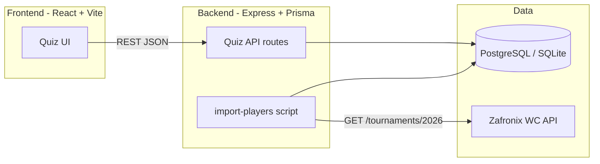
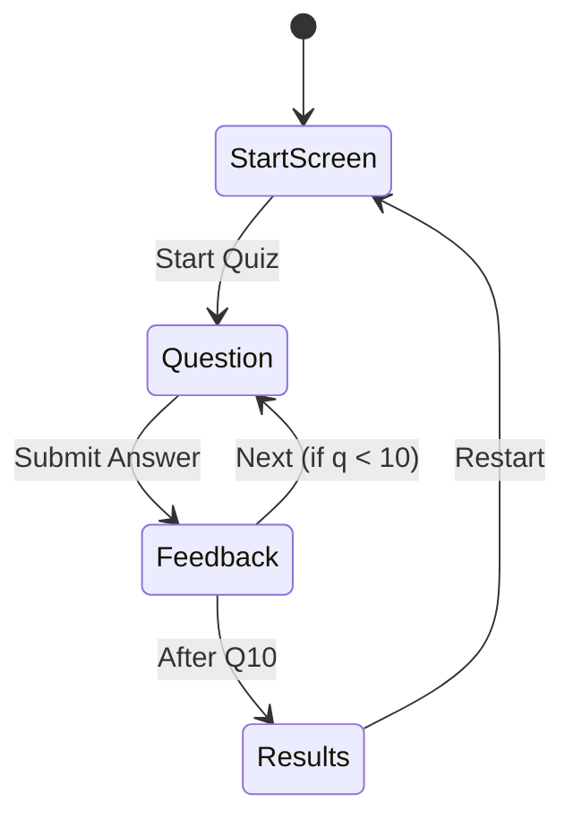

# World Cup Player Guess — Build Plan

## Current State

The project folder [`/Users/transon/Desktop/Guess WC plaỷe`](/Users/transon/Desktop/Guess%20WC%20pla%E1%BB%B7e) is **empty**. We will scaffold a new monorepo here and initialize a **local git repo inside this folder** (separate from the parent home-directory git).

## Architecture



## Tech Stack

| Layer | Choice | Why |
|-------|--------|-----|
| Frontend | React 18 + Vite + TypeScript + Tailwind CSS | Fast dev, responsive, mobile-first |
| Backend | Node.js + Express + TypeScript | Simple REST API matching assignment |
| ORM / DB | Prisma + PostgreSQL (prod) / SQLite (local dev) | Easy schema, works locally without cloud DB |
| Data import | Node script `scripts/import-players.ts` | Automated fetch + upsert |
| Data source | [Zafronix WC API](https://api.zafronix.com/docs) | Free tier, 2026 squads with name/position/club/flags |

**Why Zafronix:** One authenticated call to `GET /fifa/worldcup/v1/tournaments/2026` returns meta, all 48 teams, and every player (name, position, club, jersey). No manual CSV. Free tier: 250 requests/day (import uses ~1 request).

**Fallback (if API key unavailable):** Download from the public [FIFA World Cup 2026 Dataset](https://github.com/mominullptr/FIFA-World-Cup-2026-Dataset) CSV via raw GitHub URL — same import script, different adapter.

## Data Model (Prisma)

```prisma
model Country {
  id        Int      @id @default(autoincrement())
  name      String   @unique
  code      String?  // FIFA 3-letter code
  flagUrl   String?
  players   Player[]
}

model Player {
  id        Int      @id @default(autoincrement())
  name      String
  position  String?
  club      String?
  jersey    Int?
  countryId Int
  country   Country  @relation(fields: [countryId], references: [id])
  externalId String? // Zafronix player key for dedup
  @@unique([name, countryId])
}
```

## Import Script

File: [`backend/scripts/import-players.ts`](backend/scripts/import-players.ts)

1. Read `ZAFRONIX_API_KEY` from env (user signs up free at [api.zafronix.com](https://api.zafronix.com/)).
2. `GET https://api.zafronix.com/fifa/worldcup/v1/tournaments/2026` with header `X-API-Key`.
3. Parse `tournament.teams[]` → upsert `Country` (name, code, flagUrl from `flag.flagUrl`).
4. Parse each team's roster → upsert `Player` (name, position, club.name, jersey).
5. Log summary: teams count, players count, skipped rows.
6. Exposed as `npm run import:players` in backend `package.json`.

## Backend API

Base path: `/api`

| Method | Endpoint | Purpose |
|--------|----------|---------|
| `GET` | `/health` | Health check for deployment |
| `GET` | `/quiz/question?exclude=1,2,3` | Random player + 4 shuffled country options (correct answer **not** included) |
| `POST` | `/quiz/answer` | Body: `{ playerId, selectedCountryId }` → `{ correct, correctCountry, player }` |
| `GET` | `/stats` | Optional: total players/teams in DB (for admin/debug) |

**Question generation logic** ([`backend/src/services/quiz.service.ts`](backend/src/services/quiz.service.ts)):
- Pick random `Player` (excluding IDs in `exclude` query param).
- Pick 3 random wrong `Country` records + the player's correct country.
- Shuffle the 4 options; return `{ player: { id, name, position, club }, options: [{ id, name, flagUrl }] }`.

**Answer validation:** Server looks up `Player.countryId` and compares to `selectedCountryId` — score stays on the client (no server session needed).

## Frontend Quiz Flow

File structure: [`frontend/src/`](frontend/src/)



**Screens / components:**
- `StartScreen` — title, rules, "Start Quiz" button
- `QuizQuestion` — player name (large), position + club as subtitle, 4 country buttons with flags
- `FeedbackBanner` — green/red result + show correct country if wrong
- `ScoreBar` — "Question 3/10 · Score: 2"
- `ResultsScreen` — final score (e.g. 7/10), percentage, "Play Again"

**State (React):** `questionIndex`, `score`, `askedPlayerIds[]`, `phase` (`start | question | feedback | results`).

**Responsive design:**
- Mobile: stacked country buttons, full-width tap targets (min 48px height)
- Desktop: 2×2 grid of options, centered card layout (max-width ~640px)
- Tailwind breakpoints: `sm`, `md`

## Project Structure

```
Guess WC plaỷe/
├── README.md                 # Setup, env vars, import, deploy instructions
├── .gitignore
├── package.json              # npm workspaces root
├── backend/
│   ├── package.json
│   ├── prisma/schema.prisma
│   ├── scripts/import-players.ts
│   └── src/
│       ├── index.ts          # Express app
│       ├── routes/quiz.routes.ts
│       └── services/quiz.service.ts
└── frontend/
    ├── package.json
    ├── vite.config.ts        # proxy /api → localhost:3001 in dev
    └── src/
        ├── App.tsx
        ├── api/client.ts
        └── components/...
```

## Local Development

```bash
# 1. Install deps
npm install

# 2. Set env in backend/.env
DATABASE_URL="file:./dev.db"
ZAFRONIX_API_KEY="your-key"

# 3. Migrate + import
npm run db:migrate -w backend
npm run import:players -w backend

# 4. Run both
npm run dev   # backend :3001, frontend :5173
```

## Deployment (for you to do later)

When ready to submit:

1. **GitHub:** `git init` in project folder → create repo on GitHub → push.
2. **Database:** Create free PostgreSQL on [Neon](https://neon.tech) or [Supabase](https://supabase.com).
3. **Hosting (recommended: Render):**
   - One Web Service: build backend, run `prisma migrate deploy`, run import script once, serve API + static frontend build.
   - Env vars: `DATABASE_URL`, `ZAFRONIX_API_KEY`, `NODE_ENV=production`.
4. **Submission links:** GitHub repo URL + public Render URL in README.

Detailed step-by-step deploy commands will be written in [`README.md`](README.md).

## README Deliverables

The README will document:
- Project description and screenshots placeholder
- How to get a free Zafronix API key
- Local setup + import
- API endpoint reference
- Deployment guide
- Placeholders for **GitHub repo link** and **hosted link** (you fill in after deploy)

## Out of Scope (kept minimal)

- User accounts / leaderboards
- Player photos (not reliably available from free API)
- Server-side score persistence (client state is sufficient for assignment)

## Prerequisites from You

Before running the import script locally or in production:
1. Sign up at [api.zafronix.com](https://api.zafronix.com/) for a free `ZAFRONIX_API_KEY` (no credit card).

Everything else (scaffolding, code, import script, quiz logic, responsive UI) will be built in Agent mode after you approve this plan.
